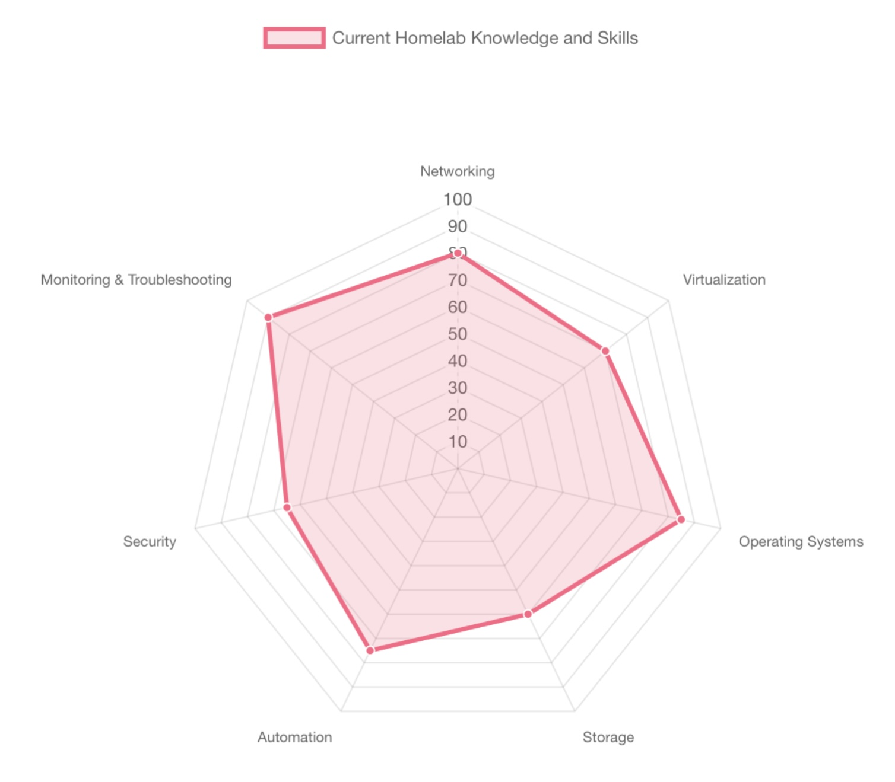
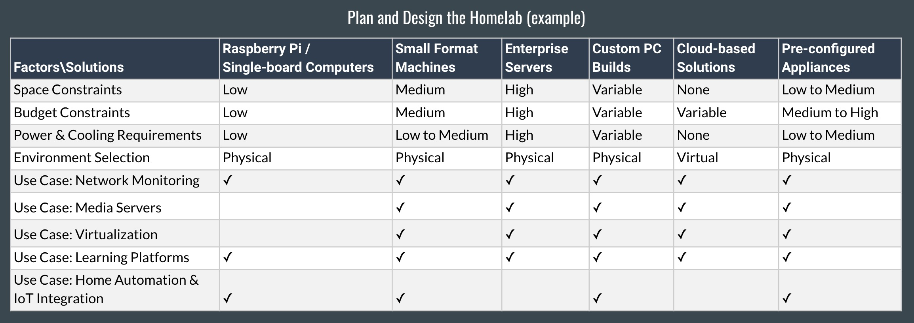
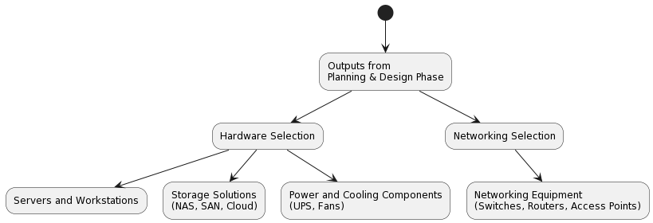
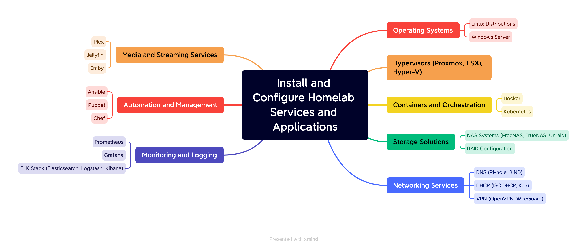

# Homelab Blueprint: An Outline to Help You Build a Successful Homelab

Here's a high-level roadmap and a more detailed outline to help fellow enthusiasts dive into the world of homelabs while incorporating enterprise best practices in a relatable and enjoyable manner. As someone who's been in tech for quite some time, many of the concepts were familiar, but I had never been responsible for the entire ecosystem. I've spent the last six months actively building my homelab, learning from this fantastic community, amazing YouTubers, and engaging in various homelab Discord servers. One challenge I faced was understanding the bigger picture and knowing where to start. For me, having a solid outline and plan was a game-changer. So, here's my current plan, which I'm considering expanding into a full-fledged guide. I hope this helps others kickstart their homelab journey more efficiently.

Also, I received some great feedback on this guide. First and foremost, it's your journey, so pay special attention to your goals and desires with your homelab. Have fun, and make it yours. It doesn't have to be perfect or enterprise class. The below is less a prescriptive guide on what you must do and more of a choose-your-own-adventure guide.

I'm open to any feedback or suggestions you might have.

Happy homelabbing, folks!
___

## High-Level Roadmap

1. Determine Goals and Purpose
2. Assess Current Knowledge and Skills
3. Plan and Design the Homelab
4. Select and Acquire Hardware
5. Install and Configure Hardware
6. Set Up Networking
7. Install and Configure Software
8. Implement Security Best Practices
9. Install and Configure Homelab Services and Applications
10. Establish a Monitoring and Maintenance Routine
11. Learn and Experiment
12. Share Your Experience with the Community
13. Expand and Upgrade Your Homelab

___

## Detailed Outline

### Introduction

* Purpose of the guide
* What is a homelab?
* Benefits of having a homelab
* Homelab community and resources
* Have fun and just get started

___

[](https://mermaid-js.github.io/mermaid-live-editor/edit#pako:eNp9U8Fu2zAM_RVDpxbwgtpp7NQYBnRp0R7aIViKFRhyoW0mEWKJhix3SYP8eyl7WWonmE4S-chHPZI7kVGOIhFK6lxBOdeeZ4jsxcUjKSwg_Zqabw8EReWBzt1jWpuSKqwuLx3W86ZoKtJQtC93HilNJVZHgzsPoNCFz9C8cUTX-ROtoYYJuI7l0XmvLRoLUivUthvzjLmEJqM12Atrq2gJX1YInMSbTlr_E4LRHfSEKeRCZmAl6V5lP9D-IbN2iW5zJpGVNQ2uC5ttK4vqf6jZWhaFA9zhGxZUnn5oamhpQJ3-5BXTs4EvWNmuWpsSjXSAMyX-ksbWUMj3M74JaScyB_e9XBQtPFq4AhiVYdmr-jtk67ps-kBFfUbBSUF1fui8zA5zcWjPbW1J9UiPrW2GpSdTgZuu5V6l209CKzD2r15HuhPvk1yu7InU_9w8NUZRxUJyAuELxU-QOS_KzkXMhV2hwrlI-JqDWc_FXO8ZB_yd2VZnIrGmRl_UZc7TdyfBtVYkC14ktpagRbITG5F8GYXjwc1VHIZhFEfxMPDFlq1BPB4Mg-s4jEbR6CaIR3tfvBNxhnAQXjXnOo7GwziIfMFqWTLP7R4369ww_G7wDeP-AwexKag)

### Determine Goals and Purpose

* Personal interests and hobbies
* Learning and skill development
* Testing and experimentation
* Home automation and media server
* Remote work and collaboration
* Business and professional development
* Security and privacy
* Data storage and backup
* Networking and infrastructure
* Cloud computing and virtualization
* Gaming and entertainment
* Other

___

### Assess Current Knowledge and Skills

* Identifying strengths and weaknesses
* Identifying learning gaps
* Identifying learning objectives
* Creating a learning plan
* Identifying learning resources and tutorials

___

### Plan and Design the Homelab

* Develop a Documentation and Note-Taking Routine
  * Common documentation tools
    * Markdown editors (Typora, Visual Studio Code, Joplin, Obsidian)
    * Note-taking apps (Notion, OneNote, Evernote, Apple Notes, Trilium Notes)
    * Text editors (Sublime Text)
    * Wikis (DokuWiki, MediaWiki, BookStack)
    * Version control for documentation (Git, GitHub, GitLab)
  * Diagramming tools
    * Draw.io (also known as diagrams.net)
    * Lucidchart
    * Microsoft Visio
    * yEd Graph Editor
    * Excalidraw
    * Mermaid
* Define Your Budget
* Determine Space and Location Requirements
* Consider Power and Cooling Needs
* Choose between Physical and Virtual Environments
* Plan and Design Architecture
* Plan and Design Security Approach
* Considerations for Scalability and Future Expansion

___

### Select and Acquire Hardware

* Servers and Workstations
* Networking Equipment (Switches, Routers, Access Points)
* Storage Solutions (NAS, SAN, Cloud)
* Power and Cooling Components (UPS, Fans)
* Hardware Recommendations and Resources (PCPartPicker, Newegg, Amazon, eBay, Micro Center, etc.)

___

### Install and Configure Hardware

* Assemble and Organize Hardware Components (Rack, Cable Management, etc.)
* Test Hardware Components for Functionality (Power, Network, Storage, etc.)
* Establish Proper Cable Management Practices (Cable Ties, Velcro, etc.)
* Configure BIOS/UEFI Settings (Boot Order, RAID, etc.)

___

### Set Up Networking

* Network Topology and Design
* Configure Routers and Switches (DHCP, DNS, VLANs, etc.)
* Configure Network Interfaces (Static IP, etc.)
* Set Up Wi-Fi and Access Points (Guest Networks, Isolation, etc.)
* Implement Network Security
  * Wi-Fi Encryption (WPA2/WPA3)
  * Guest Networks and Isolation (Separate SSIDs, VLANs, etc.)
  * Device and Service Hardening (Firewalls, Intrusion Detection, etc.)
* Implement Network Segmentation and VLANs (LAN, WAN, DMZ, etc.)
* Establish Remote Access (VPN, SSH, RDP, etc.)

___

### Install and Configure Software

* Create a Bootable USB Drive for Multiple ISO Files (Ventoy)
* Choose and Install Operating Systems
  * Linux (Ubuntu, RHEL, Debian)
  * Windows
  * MacOS
* Choose and Install Hypervisors
  * Proxmox
  * Microsoft Hyper-V
  * VMware ESXi
  * Post Hypervisor Configuration, Install and Configure Virtual Machines
* Implement Containerization
  * Docker / Docker Compose
    * Portainer
  * Kubernetes
    * K3S, Rancher, MicroK8s, etc.
    * Kubernetes Storage (Longhorn, NFS)
    * MetalLB: Load balancer for bare metal Kubernetes clusters
    * Kubeapps: Kubernetes Application Manager

___

[](https://mermaid-js.github.io/mermaid-live-editor/edit#pako:eNp9k01P4zAQhv9K5AOnUqVO048IIfVztVKLEN3dw7o9mGRarCZ25DhAqfrfGccxgkXaXJyJn7zzznh8JqnKgCTkoHn5FKwetjLAZ8IWrwa05HnwS_P9XqS74Pr6Npj22E9pdF0JJW8e9e29hmeQpo02p8pAsWsl3A-U_bm_s5s_uIEXfmp3pxH7XYGu2nDZwLMeuwPzovSxUYNDgdrcqrfYrOc4yiZpClVlsZlCQyoPVqIyXm5GHeeSWGpSmydrNP0iFzXYnM254cFVw5Vl3kJebOqSLpnVUFq8QdaQqRHPwnwU5FIufXmfo4WLFn02yUE3Lt1GVT-6vi-Fxubkuc_oNb2aL9-X5_27dd428ZssnpU7xA2ktUaz_9cBmXmJuXMcsbWSwmDV8hBcBSt1OODbzjM3DYSnIW0vcCyQWcisVEKaj5z_0D025emxLhF9gFQ9gz5978cky4Q9g0_WgzXwqtZQtT1ta1hQ3-N27X-pBRfSIQXogosMx_xsd7cEh6GALUnwNeP6uCVbeUGO10ZtTjIlCc44dEhdZji1c8HRVUGSPc8r_FpySZIzeSVJHHcHvWhEw3BE-3QU9jvkRBI6iLvhsD-kYRRH8WAcXzrkTSkUCLvjOIxG45AO43Ec0w6BzHZ37e5gcxUb_b8Nbk1c3gHayBdT)

### Implement Security Best Practices

* Implement Password and Access Management Systems
  * Authelia: Single sign-on and two-factor authentication server
  * Authentik: Self-hosted identity and access management platform
  * Teleport: Secure access management for SSH, Kubernetes, and web applications
  * Vault: Secure, store, and tightly control access to tokens, passwords, certificates, API keys, and other secrets in modern computing
  * Bitwarden: Open source password management solutions for individuals, teams, and business organizations
* Set Up Firewalls and Intrusion Prevention Systems (IPS)
* Configure Reverse Proxies and Traffic Management
  * Traefik: Reverse proxy and load balancer
  * Cloudflare Reverse Proxy
  * SSL/TLS Termination and Certificate Management
  * Load Balancing and Failover (HAProxy)
  * Access Control and Rate Limiting
  * DDoS Protection (Cloudflare)
  * Implement DNS Over HTTPS (DoH)
  * Implement DNS Over TLS (DoT)
* Implement Virtual Private Networks (VPNs)
  * VPN Protocols and Software (OpenVPN, WireGuard, IPsec)
    * Configure and Manage VPN Clients and Servers
    * Site-to-Site VPNs (OpenVPN, WireGuard, IPsec)
    * Remote Access VPNs
  * VPN Gateways (AWS, Azure, GCP)
  * VPN Services (Mullvad, ProtonVPN, NordVPN, ExpressVPN)
* Implement Security Overlay Networks
  * Tailscale: Secure, zero-config, mesh VPN
  * ZeroTier: Secure, scalable, and simple virtual networking
  * Integration with Existing Homelab Infrastructure (DNS, DHCP, VPNs)
  * Secure and Manage Overlay Networks
  * Implement Zero Trust Networks
* Apply Encryption and Secure Communications (TLS/SSL)
  * Let's Encrypt: Free, automated, and open certificate authority
  * Certbot: Free, automated, and open certificate authority
* Perform Regular Updates and Patching (OS, Applications, Firmware)
* Implement Backup Solutions (Local and Cloud)
  * Veeam: Backup and replication software
  * Duplicati: Backup software
  * BorgBackup: Deduplicating backup program

___

### Install and Configure Homelab Services and Applications

* Utilize Automation and Configuration Management Tools
  * Ansible: IT automation tool
  * Puppet: Configuration management tool
  * Chef: Configuration management tool
* Set Up DNS and DHCP Servers
  * bind9: DNS server
  * PiHole: Network-wide ad blocker and DNS server
  * AdGuard: Network-wide ad blocker and DNS server
  * Load Balancing and Failover (keepalived)
  * Gravity Sync (PiHole Synchronization)
* Implement GitOps
  * FLUX / Argo CD
  * Git
  * Ansible
* Configure CI/CD
  * GitHub Actions
  * GitHub Runner Actions
* Deploy Network Attached Storage
  * TrueNAS Scale
  * FreeNAS
  * OpenMediaVault
* Implement Dashboard
  * Heimdall: Dashboard for all your web apps
  * Organizr: HTPC/Homelab Services Organizer
  * Homer: Dashboard for all your web apps
* Deploy Content Management Systems
  * WordPress: Blogging platform
  * Ghost Blog: Blogging platform
  * WikiJS: Wiki software
* Set Up Web Servers
  * Apache
  * Nginx
  * IIS
* Configure Database Servers
  * MySQL
  * MariaDB
  * PostgreSQL
  * SQL Server
* Deploy Media Servers
  * Plex
  * Emby
  * Jellyfin
* Implement Home Automation
  * HomeKit
  * HomeBridge
  * Home Assistant
* Set Up File Synchronization, Sharing, and Collaboration Tools
  * Syncthing
  * Nextcloud
  * ownCloud
* Deploy Static Sites and Custom Code
  * Hugo
  * Jekyll
* Manage Links
  * Shlink: Link Shortener and QR Code Generator
  * LittleLink: Link Page

___

[](https://mermaid-js.github.io/mermaid-live-editor/edit#pako:eNqNk8tuwjAQRX_F8iqVYAHZsaiEWtRKQFWVtqtshmQIVvyIHAeJAv_esQnhVVQ2scc-nusZ32x4ajLkA55bKJds8pFoxqp6vg8T_moUSpizGdqVSLFioDM2LEspUnDC6Crh_gRjUJa9iDZ6D23c93H_GMc-jkOMOkv0hdTUaOGMFTpnn8bINjPtL0BD9LIfm3ylpZu5JdZV9N5Om726dEJh9BUGNq4V3BSdmJxNKWuOCrU7SEpTiGhCnxMxB0IGKT9p1lEW0WgyZjMHaXFTYyjROl-W792bcWJx1TxPqNxGAVXhPrbVgMoFIBr5aUDOtXzvWbf7uH1BjRYcsik6K9Jqe9KmBuzfC8b3ghfS1NGG8o36W_VPJr6D2Ws9LTEt2HBF6zAXUrj1tnnzM7l_sfgO7FhugL9FVYMUPycNafzpYe-bC2xfxglzqChwMzL8gfGHr4ChBrlu05DfPNFkC0DwE934YKFgDFmc7R0tlGje4QqtApHRT7_xdMKpPCqWD2iagS28K3fEQe3MbK1TPnC2xg6vy4we5lkA6Ss-WICscPcL2Y95Mw)

### Establish a Monitoring and Maintenance Routine

* Set Up Monitoring Tools and Dashboards
  * Uptime Kuma: Monitor your servers and websites
  * Grafana: Data visualization and monitoring
  * Prometheus: Monitoring and alerting
* Implement Log Management and Analysis
  * Loki: Log aggregation
  * Promtail: Log collection
  * ELK Stack: Log management and analysis
  * Graylog: Log management and analysis
* Configure Alerting and Notification Tools
  * Alertmanager (Prometheus)
  * ElastAlert (ELK Stack)
  * Grafana Alerting
* Monitor UPS Battery
  * NUPS Server - Network UPS Tools
* Perform Regular Maintenance Tasks
  * Updates and Patches (OS, Applications, Firmware)
  * Cleaning and Maintenance (Fans, Cables, Drives)
  * Backups and Data Recovery (Data, Configuration, Images)
* Troubleshoot and Resolve Problems Quickly and Efficiently
  * Identify and Diagnose Issues with Monitoring Tools and Dashboards
  * Resolve Issues with Minimal Downtime and Data Loss

___

### Learn and Experiment

* Access Study Materials and Resources Online
  * Cisco Learning Labs
  * Microsoft Learn
  * Pluralsight
  * Udemy
  * YouTube
  * Reddit
  * GitHub
  * Stack Overflow
  * Cisco DevNet
  * Microsoft Learn
  * Katacoda
* Pursue Certifications and Online Courses
  * Cisco
  * Microsoft
  * CompTIA
  * Linux Foundation
  * Google
  * Amazon
  * VMware
  * Red Hat
  * IBM
  * Juniper
  * Palo Alto Networks
  * Check Point
* Attend Meetups and Conferences
  * Meetup Groups
  * Conferences
* Challenge Yourself with Projects and Experiments (Homelab Projects)
  * Build a Home Server
  * Build a NAS
* Utilize Online Labs and Sandboxes for Hands-On Practice
  * Cisco DevNet
  * Microsoft Learn
  * Katacoda
* Stay Informed on Industry Trends and Technologies
  * Blogs
  * Podcasts
  * YouTube Channels
  * Twitter
  * Reddit
  * GitHub
  * Stack Overflow
  * LinkedIn
  * Hacker News
  * TechMeme
  * TechCrunch
  * Ars Technica
  * Slashdot
  * TechRepublic
  * TechRadar
  * CNET
  * The Verge
  * Wired  

___

### Share Your Experience with the Community

* Engage in Online Forums and Discussion Groups
  * Reddit
  * Discord
* Document Your Homelab Journey
  * YouTube
  * GitHub
  * Reddit
* Create Tutorials or Blog Posts
* Collaborate on Projects with Others
* Provide Support and Advice to Newcomers

___

### Expanding and Upgrading Your Homelab

* Identify Areas for Improvement
* Invest in New Hardware or Software
* Integrate New Services and Technologies
* Automate Tasks and Processes
* Improve Efficiency and Performance
* Increase Reliability and Availability

___

## Conclusion

 I will continue to update this document as I learn more and as the homelab ecosystem evolves. I hope you found it useful and that it helps you on your homelab journey. If you have any questions or comments, please feel free to reach out to me on [Twitter](https://twitter.com/veteranbv) or [Reddit](https://www.reddit.com/user/veteranbv/).

___

## Special Thanks

* [Homelab Reddit Community](https://www.reddit.com/r/homelab/wiki/index)
* [TechnoTim YouTube](https://www.youtube.com/@TechnoTim) / [TechnoTim GitHub](https://github.com/techno-tim)
* [Christian Lempa YouTube](https://www.youtube.com/@christianlempa) / [Christian Lempa GitHub](https://github.com/ChristianLempa)
* [DB Tech](https://www.youtube.com/@DBTechYT)
* [Wolfgang](https://www.youtube.com/@WolfgangsChannel)
* [Jeff Geerling](https://www.youtube.com/@JeffGeerling)
* [VirtualizationHowTo](https://www.youtube.com/@VirtualizationHowto)
* [NetworkChuck](https://www.youtube.com/@NetworkChuck)
* [Mactelecom Networks](https://www.youtube.com/@MactelecomNetworks)
* [Crosstalk Solutions](https://www.youtube.com/@CrosstalkSolutions)

___

## Tools Used

* [Mermaid](https://mermaid-js.github.io/mermaid/#/)
* [PlantText](https://www.planttext.com/)
* [Chart.js](https://www.chartjs.org/)
* [Xmind](https://www.xmind.net/)
* [Bing Image Create](https://www.bing.com/images/create)
* [ChatGPT](https://chat.openai.com/chat/)
