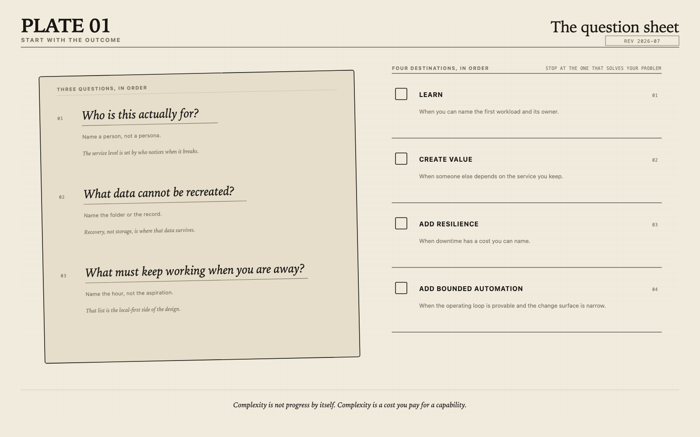
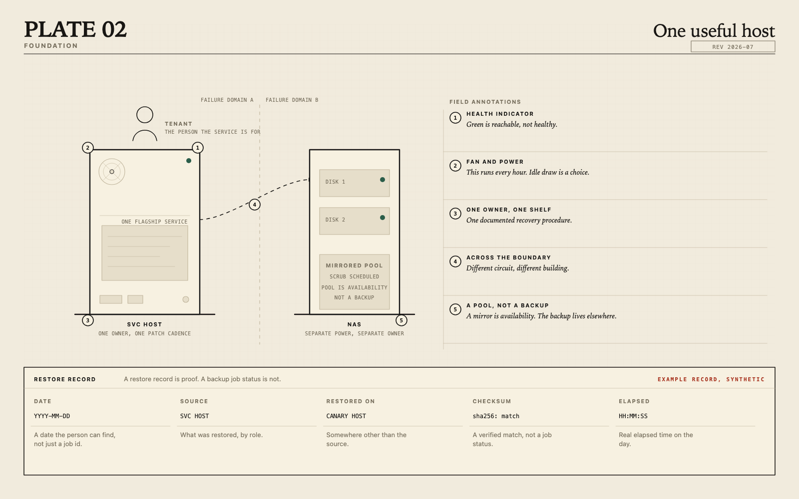
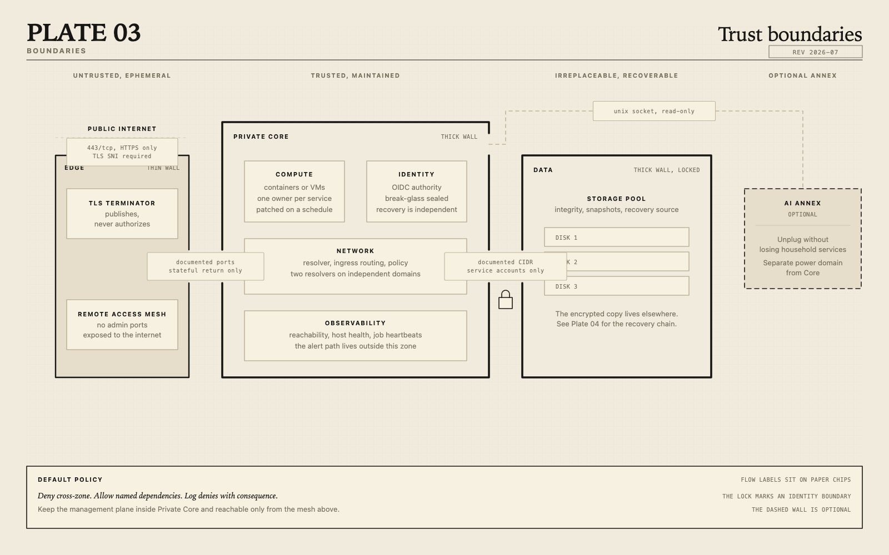
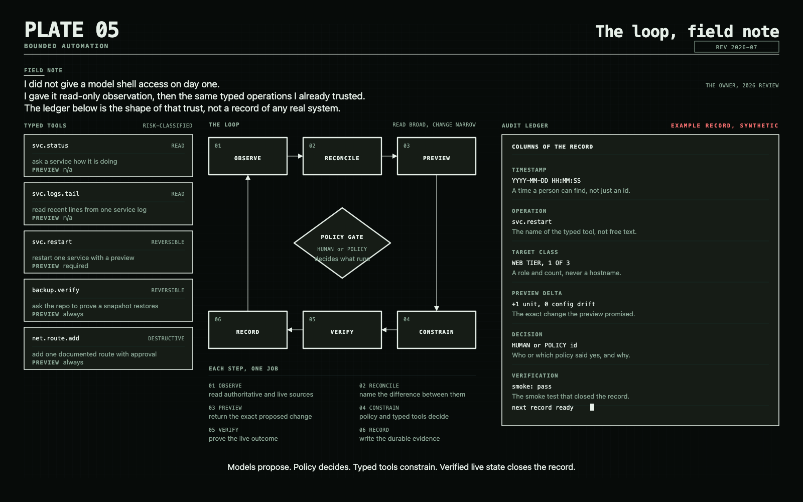

# Homelab Blueprint

An opinionated, evidence-backed path from one useful home server to a resilient,
AI-capable homelab.

Read the maintained guide at [homelab.codes/guide](https://homelab.codes/guide/),
or use this repository as the complete GitHub-native mirror.

This is a guide to making decisions, not a catalog of every product you could
install. Start with a problem worth solving. Add the smallest system that
solves it. Earn every extra layer through a real need: isolation, recovery,
scale, learning, or household value.

The whole design is drawn as five architect-style plates. Each plate is a
working sheet. Read them in order, or jump to the one you are about to build.

## The five plates

### Plate 01. The question sheet

The lab follows from three answers. If you cannot name a person the service is
for, a folder that cannot be recreated, or an hour that must keep working, the
architecture is guessing. Start by writing the three answers down. Read
[plan before you buy](docs/01-plan.md) next.

### Plate 02. One useful host

One box, one owner, one flagship service. One backup on a different failure
domain. One restore that has worked, dated in a ledger you can find. One alert
that reaches you when the service or the backup fails. That is a complete
first lab. See [choose hardware by role](docs/02-hardware.md) and
[choose the platform](docs/03-platform.md).

## Start here

Choose the path closest to your actual goal:

| Goal | Start with | Add next only when needed |
| --- | --- | --- |
| Learn Linux and networking | An existing PC or small mini PC running Debian or Ubuntu | Docker Compose, monitoring, then virtualization |
| Run useful household services | One maintainable host, Compose, backups, and remote access | Separate storage and compute when failures become expensive |
| Build a serious infrastructure lab | Proxmox VE, source-of-truth inventory, configuration management, and tested recovery | Clustering, segmented networks, and Kubernetes for a defined learning goal |
| Explore local AI and agents | A separate inference host or workstation plus a narrow API boundary | Tool access, approval gates, audit evidence, and bounded autonomous loops |

If you are buying hardware before you can name the first workload and its
recovery plan, pause. The best first homelab is usually the computer you
already own.

## The roadmap

1. [Set goals, constraints, and a budget](docs/01-plan.md)
2. [Choose hardware by role](docs/02-hardware.md)
3. [Choose a platform](docs/03-platform.md)
4. [Design the network and access model](docs/04-networking.md)
5. [Protect storage and prove recovery](docs/05-storage-backup.md)
6. [Build identity, secrets, and patching into the design](docs/06-security.md)
7. [Pick services that create real value](docs/07-services.md)
8. [Operate what you install](docs/08-operations.md)
9. [Move from manual work to a control plane](docs/09-automation.md)
10. [Add local AI and an agentic operations harness](docs/10-ai-agentic.md)
11. [Grow, experiment, and share responsibly](docs/11-grow-share.md)

### Plate 03. Trust boundaries

A trust boundary is a wall with named doors. Deny cross-zone by default. Allow
each documented flow with the specific port, direction, and identity that
should use it. Keep administration inside the core and reachable only from a
private mesh. See [design the network](docs/04-networking.md) and
[build security into the design](docs/06-security.md).

### Plate 04. The recovery chain

A backup is a claim. A restore is evidence. Target 3-2-1-1-0: three copies,
two media or failure domains, one off-site, one offline or immutable, zero
unverified errors. Record each restore on a clean target with a dated,
checksum-matched ledger row. See
[protect storage and prove recovery](docs/05-storage-backup.md).

### Plate 05. The loop, field note

The agent came last. I made the lab legible first: inventory, structured
commands, dry runs, health gates, and recovery paths. Routine work got
faster. Failures got easier to explain. When policy, previews, and evidence
already surrounded every consequential command, the agent could use the same
typed operations I already trusted. See
[build a control plane](docs/09-automation.md) and
[add local AI and an agentic operations harness](docs/10-ai-agentic.md).

## Defaults that hold up

- **Applications:** Docker Engine with current `docker compose` on one Linux host.
- **Mixed workloads:** Proxmox VE when virtual machines, passthrough, snapshots,
  or isolation earn the hypervisor layer.
- **Kubernetes:** K3s when learning or multi-node scheduling is the stated goal,
  not as the default way to run five containers.
- **Storage:** OpenZFS through TrueNAS Community Edition or a deliberately
  managed host when data integrity matters.
- **Recovery:** native application exports, encrypted repository backups, a
  separate off-site or offline copy, and tested restores.
- **Remote access:** a private WireGuard-based overlay such as Tailscale before
  exposing administrative ports.
- **Observability:** reachability, host metrics, job heartbeats, and alerts before
  adopting a large telemetry stack.
- **Local AI:** choose hardware by usable accelerator memory and workload, then
  keep inference separate from household-critical infrastructure where practical.

The [reviewed recommendations registry](recommendations.toml) records 26 core
infrastructure and flagship-service choices, their roles, project locations,
and last-reviewed dates. Individual guides cite the primary evidence behind
additional specialist choices. Automated checks catch obvious drift; humans
still make recommendation decisions.

## What changed since the original blueprint

The first version was written in 2023 while I was building my own lab. The
goals-first journey still holds. The long product lists and decorative AI
images did not.

This rebuild replaces them with:

- decision frameworks instead of name dumps;
- current project-health and community evidence;
- architecture drawings with editable, deterministic sources;
- recovery, power, and operations as first-class design work;
- local AI and agentic operations with explicit safety boundaries;
- five architect-style plates whose SVGs are produced from the same TypeScript
  source the interactive site renders; and
- short field notes from a real homelab with hostnames, addresses, topology,
  and identifiers removed.

The full retirement and replacement plan for every legacy visual is in
[docs/visual-replacement-ledger.md](docs/visual-replacement-ledger.md).

## How recommendations are made

Official documentation and release history establish what a project is and
whether it is supported. Practitioner evidence establishes how it behaves in
real homelabs. Popularity helps discover candidates. It is never enough by
itself.

Every recommendation is checked for maintenance state, license, documentation,
upgrade and export paths, operational cost, security posture, and fit for the
reader's goal. The dated [research notes](docs/research-notes.md) show the
review method and representative practitioner evidence. See
[Contributing](CONTRIBUTING.md) for the full standard.

## License

Prose and visual assets are licensed under
[CC BY 4.0](LICENSE). Repository tooling is licensed under
[MIT](LICENSE-CODE).
